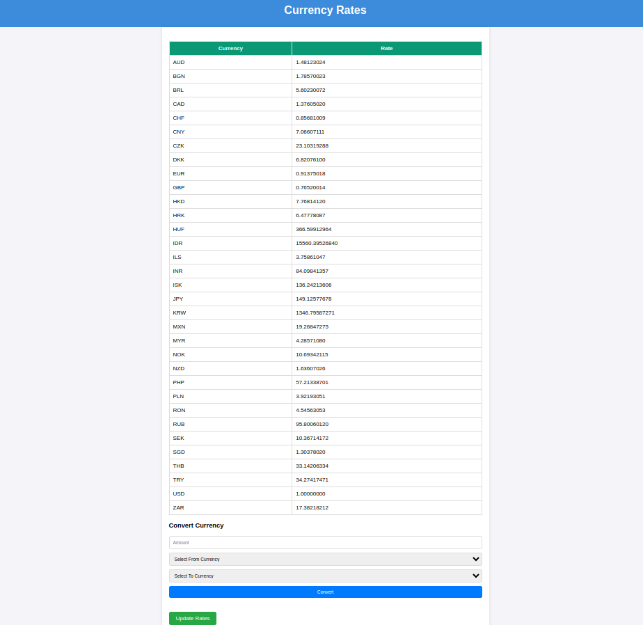

# Currency Converter

## Description
An application for displaying current currencies and converting them using data from [freecurrencyapi.com](https://freecurrencyapi.com).

## Requirements
- PHP >= 8.0
- Composer
- Node.js and npm
- MySQL 8.0

## Installation

1. Clone the repository:
   ```bash
   git clone https://github.com/Andrey-Yurchuk/currency-converter.git

2. Go to the project directory:
    ```bash
   cd currency-converter

3. Installing dependencies using Composer
   ```bash
   composer install
   
4. Installing dependencies using npm
   ```bash
   npm install

5. Configuring the .env file.
   Copy .env.example to .env and configure the database and API key settings:
   ```bash
   cp .env.example .env

6. Open.env and make changes:
   ```bash
   DB_CONNECTION=mysql
   DB_HOST=127.0.0.1
   DB_PORT=3306
   DB_DATABASE=currency_converter
   DB_USERNAME=<your_user>
   DB_PASSWORD=<your_password>
   FREECURRENCYAPI_KEY=<your_API_key>

Note: To get an API key, register on [Free Currency API](https://freecurrencyapi.com)

7. Creating a database.
   Create a database in MySQL corresponding to the settings in the .env file.

8. Make migrations:
   ```bash
   php artisan migrate

## Start project 

1. Start the Laravel server
   ```bash
   php artisan serve

2. Run Vite to compile assets
   ```bash
   npm run dev

## Using

- Open a browser and go to http://127.0.0.1:8000/register
- Enter your name, email address and create a password in the form
- After successful registration, you will be taken to the page http://127.0.0.1:8000/dashboard. 
  On this page, you can use the link "View currency rates" to go to the page with currency rates 
  and currency converter http://127.0.0.1:8000/admin/currencies

## Screenshot



*The screenshot above shows the user interface of the Currency Converter application, illustrating how users 
can enter the amount and select currencies for conversion.*

